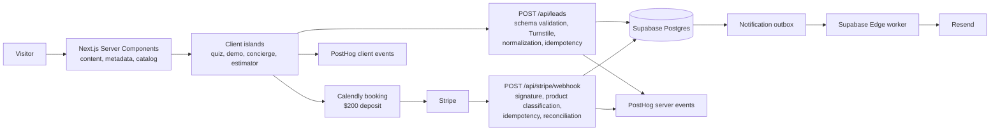

# 08 — Modernization Design

> Review date: 2026-07-03  
> Inputs: current repository architecture, `07-Gaps-and-Unfinished-Wiring.md`, production build, and current platform guidance.

## Executive summary

Teamtastic does not need a platform rewrite. Its core choices—Next.js App Router, Vercel, Supabase, Stripe, Resend, Turnstile, and PostHog—are appropriate for a marketing and lead-conversion application.

The modernization work should instead:

1. make lead and payment delivery durable;
2. establish one vocabulary and source of truth for products, prices, games, and funnel events;
3. keep content server-rendered while isolating interactive client islands;
4. turn the current build-only safety net into tested, automated delivery;
5. remove customer-facing promises and routes that are not backed by working systems.

The target is a **modular monolith**, not microservices. Next.js remains the public web and API boundary; Supabase remains the durable system of record; Edge Functions handle asynchronous notifications; external checkout remains with Calendly and Stripe.

## Current-state assessment

### What is already strong

- App Router and static generation suit a content-heavy storefront.
- Browser writes have been removed from Supabase; lead intake now crosses a server boundary.
- Turnstile is verified server-side and fails closed in production.
- Lead submissions have an idempotency key.
- Stripe signatures and event IDs protect payment processing.
- PostHog collection avoids direct contact information.
- Supabase delivery and payment tables provide the beginnings of an operational audit trail.

These choices align with current platform guidance: Next.js recommends Server Components for content, secrets, and reduced browser JavaScript, using Client Components only for state and browser APIs ([Next.js](https://nextjs.org/docs/app/getting-started/server-and-client-components)). Supabase recommends short-lived, idempotent Edge Functions for webhooks and transactional email, with credentials stored as project secrets ([Supabase](https://supabase.com/docs/guides/functions)).

### Principal risks

| Priority | Risk | Business effect |
|---|---|---|
| P0 | Notification trigger replacement is not fully activated and verified | Leads may not receive confirmation or internal follow-up |
| P0 | Stripe webhook classifies every completed checkout as a deposit | Incorrect revenue alerts and analytics |
| P0 | Demo promises credentials that no system issues | Immediate trust failure after conversion |
| P1 | Prices and product availability are duplicated and contradictory | Customer confusion and sales disputes |
| P1 | Funnel events are duplicated and cannot be stitched together | Unreliable conversion reporting |
| P1 | No automated test or deployment gate | Regressions reach production undetected |
| P1 | SEO pages lack generated metadata and a complete sitemap | Lost organic-search value |
| P2 | Client-heavy pages, raw images, and duplicated option vocabularies | Higher maintenance and weaker performance |
| P2 | Scraping artifacts and dead code remain in the production repository | Larger dependency and review surface |

## Target architecture



### Architectural principles

- **One boundary for each responsibility.** The browser collects input; the API validates and normalizes; Postgres persists; workers deliver side effects.
- **Persist before side effects.** Lead/payment success means the database commit succeeded, not that an email request was attempted.
- **At-least-once delivery with idempotent consumers.** Notifications and Stripe processing must be safe to retry.
- **Server-first rendering.** Route pages and SEO content remain Server Components; interactive widgets are small Client Components. This follows the current App Router model ([Next.js](https://nextjs.org/docs/app)).
- **Configuration must fail visibly.** Production must not render checkout links when their environment variables are missing.
- **No PII in product analytics.** Operational contact data belongs in Supabase; funnel behavior belongs in PostHog.
- **One canonical vocabulary.** Store stable keys, render friendly labels.

## Modernized subsystem design

### 1. Lead intake and domain model

Create a shared schema module, preferably using TypeScript and Zod, for:

- lead source;
- team-size band;
- vibe;
- occasion;
- recommendation key;
- UTM attribution;
- form-specific context.

All forms submit canonical keys. The API maps legacy display strings during a transition period, rejects unknown future values, and returns a typed result.

Replace the per-instance `Map` rate limiter with a durable limiter only if Turnstile metrics show abuse. Until then, bound and prune the Map, document that Turnstile is the primary defense, and avoid adding another paid service prematurely.

### 2. Durable notification outbox

Replace “insert lead, then hope an HTTP trigger succeeds” with an explicit outbox:

1. lead insert and `notification_deliveries` pending rows are created in one database transaction;
2. an asynchronous database webhook wakes the Edge Function;
3. the worker claims pending deliveries, sends through Resend, and records provider ID, attempts, next retry, and terminal failure;
4. a scheduled retry processes stale pending/failed rows;
5. an operations query identifies leads with no delivery rows.

Supabase Database Webhooks are asynchronous `pg_net` triggers and expose request history in the `net` schema ([Supabase](https://supabase.com/docs/guides/database/webhooks)). Vault remains appropriate for encrypted trigger credentials ([Supabase](https://supabase.com/docs/guides/database/vault)).

Use templates by `lead_source`:

- `event_quiz`: recommendation summary and booking/free-game actions;
- `playable_demo`: honest next step—never promise credentials unless `teamtastic.games` supplies them;
- concierge sources: acknowledgement and response-time expectation;
- internal: complete lead context and direct database/admin link.

### 3. Payments and booking

Introduce a product registry:

```text
hosted_event_deposit
pro_subscription
custom_content
```

Each product defines its display name, price policy, checkout URL variable, Stripe mode, and analytics event. The webhook classifies a session using payment-link ID or explicit metadata before recording or alerting.

- `hosted_event_deposit` → `deposit_completed`
- `pro_subscription` → `subscription_started`
- `custom_content` → `custom_content_purchased`
- unknown checkout → persist as `unclassified`, alert internally, do not call it a deposit

Add a Calendly webhook if exact lead-to-booking reconciliation becomes important. Until then, treat normalized email as the supported matching contract and report the unmatched rate.

When an internal payment alert fails, return a retryable status after the event row is stored. Stripe can retry safely because event IDs are unique.

### 4. Catalog, pricing, and recommendations

Create three canonical modules:

- `catalog`: real game slugs and capabilities;
- `products`: prices, deposits, subscription/add-on availability;
- `lead-options`: canonical team-size/vibe/occasion definitions.

Recommendations reference real catalog slugs, not free-form game titles. The quiz and concierge use one recommendation service with an audience parameter (`corporate` or `family`).

Pricing components render from the product registry. Resolve the current $35/$40 contradiction and decide whether the $99/month product is genuinely offered before exposing it anywhere.

Carry estimator selections into the quiz and then into `leads.context`; never make the user repeat information.

### 5. Next.js and SEO structure

Keep route entry files as Server Components. Move only filters, quizzes, modals, and calculators behind `"use client"` boundaries. Next.js explicitly recommends this split to limit browser JavaScript and keep secrets/server work out of the client graph ([Next.js](https://nextjs.org/docs/app/getting-started/server-and-client-components)).

Restructure the catalog:

```text
app/games/page.tsx            server metadata + CatalogView
components/catalog-view.tsx   client filtering/search only
app/games/[slug]/page.tsx     static page + generateMetadata
```

Generate:

- sitemap entries from `gamesData`;
- per-game metadata with `generateMetadata`;
- canonical URLs;
- an intentional redirect from `/activities` to `/games`.

Dynamic metadata belongs in a Server Component and is emitted in the initial HTML ([Next.js](https://nextjs.org/docs/app/api-reference/functions/generate-metadata)).

Adopt `next/image` for meaningful raster images, with explicit dimensions and priority only for above-the-fold assets.

### 6. Analytics contract

Use the browser’s anonymous PostHog distinct ID throughout the funnel:

1. client sends `analytics_distinct_id` with the lead request;
2. server uses that same ID for `lead_recorded`;
3. Stripe reconciliation reuses it for the appropriate revenue event.

Do not identify users by email. Store the anonymous ID with the lead solely for event correlation.

Standardize event properties as `snake_case`. Emit:

- intent events from the client;
- persistence/revenue truth from the server;
- no duplicate event names across both layers.

Add a simple consent control that sets `teamtastic_analytics_consent`; preserve memory-only analytics before consent and allow opt-out.

### 7. Codebase and delivery standards

Adopt TypeScript incrementally at system boundaries first:

1. lead schema and API routes;
2. payment webhook/product registry;
3. catalog/recommendation data;
4. interactive components when touched.

Add tests in this order:

- unit: normalization, recommendations, product classification;
- API integration: validation, Turnstile outcomes, idempotency, Supabase errors;
- webhook integration: signature rejection, event replay, classification, unmatched lead;
- browser smoke: all four lead sources, retained form state on error, primary/secondary CTAs.

Add GitHub Actions gates:

```text
install → lint → typecheck → unit/integration tests → build
```

Fix existing lint errors before making lint required. Upload PostHog source maps only after the CI build becomes authoritative.

Move scraping tools and raw captures under `tools/catalog-import/`, move `jimp` to development dependencies, and exclude generated bundles from normal lint/test scanning. Replace the starter README and package name.

## Delivery roadmap

### Phase 0 — Protect revenue and trust

- Activate and verify the replacement notification trigger/outbox.
- Remove the unsupported demo-credentials promise.
- Classify Stripe checkout types before alerting.
- Make failed payment alerts retry through Stripe.
- Configure and test all production environment variables.
- Resolve the public pricing contradictions.

**Exit criteria:** all four lead sources create one row and the correct email; duplicate submissions create no duplicate email; each Stripe product produces the correct event and alert.

### Phase 1 — Establish canonical contracts

- Add shared typed schemas and normalization.
- Consolidate recommendations onto real catalog slugs.
- Introduce product/pricing registry.
- Standardize analytics taxonomy and distinct-ID stitching.
- Carry estimator context into the lead.

**Exit criteria:** database grouping uses one vocabulary; pricing exists in one module; PostHog lead and revenue counts match Supabase/Stripe samples.

### Phase 2 — SEO and rendering modernization

- Generate complete sitemap and per-game metadata.
- Split catalog server shell from client filters.
- Redirect duplicate `/activities`.
- Optimize priority images and OG assets.
- Improve thin imported game content.

**Exit criteria:** no sitemap 404s; every game page has unique metadata and canonical URL; catalog content exists in initial HTML.

### Phase 3 — Engineering safety

- Introduce boundary-first TypeScript and Zod.
- Add unit, API, webhook, and browser tests.
- Fix lint baseline and enable CI gates.
- Add source-map upload and operational alerts.
- Archive import artifacts and remove dead code.

**Exit criteria:** pull requests cannot merge with lint, type, test, or build failures; production incidents can be traced to a deployment and readable stack.

## Decisions and non-goals

### Decisions

- Keep Next.js, Vercel, Supabase, Stripe, Calendly, Resend, Turnstile, and PostHog.
- Keep checkout external for now.
- Use email—not Slack or paid SMS—for internal alerts.
- Preserve anonymous analytics; do not use email as an analytics identity.
- Prefer a database outbox over adding a queue vendor at current scale.

### Non-goals

- No microservice split.
- No CMS migration until content editing frequency justifies it.
- No custom checkout UI.
- No Redis/KV dependency until observed abuse requires distributed rate limiting.
- No full TypeScript rewrite.

## Immediate implementation backlog

1. **P0:** deploy and verify the lead migration, Vault values, Edge secrets, and delivery path.
2. **P0:** correct demo success copy and email template.
3. **P0:** add Stripe product classification and retry behavior.
4. **P1:** create canonical lead options, product registry, and recommendation catalog.
5. **P1:** remove duplicate PostHog lead events and stitch anonymous IDs.
6. **P1:** repair sitemap and add per-game metadata.
7. **P1:** add tests and CI, then enforce lint.
8. **P2:** refactor catalog rendering and image delivery.
9. **P2:** archive scraping assets, remove dead code, and modernize project documentation.

