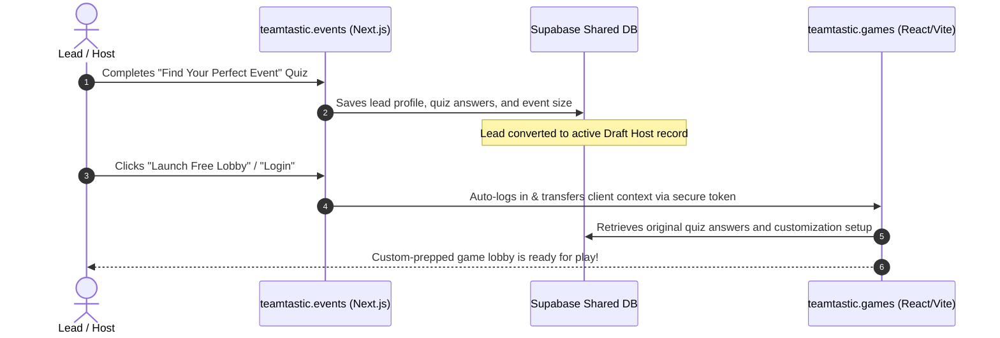

# 🚀 Teamtastic Website Strategy & Architecture Plan

This document establishes the comprehensive commercial and technical strategy for **Teamtastic**. It defines the core market positioning and technical blueprints to establish a high-conversion, high-energy marketing storefront on **`teamtastic.events`** that links seamlessly with the virtual arcade engine on **`teamtastic.games`**.

---

## 🎨 Design Mockup & Visual Inspiration

We have generated a high-fidelity visual mockup representing the core design system and hero energy planned for the website. The mockup features a vibrant, high-energy virtual stage hosted by the founder as the Master Emcee, standing in an open-handed welcoming pose in a branded Teamtastic polo shirt (with the logo raised and "Teamtastic" written directly below it), surrounded by floating emoji reactions, chat engagement, and a neutral "Virtual Event" frame that fits all web conferencing platforms.


---

## 🎯 1. Market Positioning & Unique Value Proposition (UVP)

### The Core Tagline
> **"Play. Connect. Celebrate."**

This original, powerful tagline represents the absolute pillar of our corporate philosophy. To inject maximum game-show energy and visual contrast, the typography will be rendered in a distinct, high-impact style:
*   **"Play. Connect."** will be styled in a modern, ultra-bold, clean B2B sans-serif font (e.g., *Outfit* or *Inter*).
*   **"Celebrate."** will be styled in an energetic, glowing, handwritten neon script font (e.g., *Caveat* or *Pacifico* from Google Fonts), highlighted in a cyber-pink text-shadow to make it leap off the screen.

### The Problem
Most virtual team-building activities are either **dry, awkward corporate icebreakers** (e.g., standard "tell us a fun fact" virtual meetings) or **clunky, consumer-oriented games** (e.g., Jackbox or Kahoot!) that lack corporate scaling, team-level scoring, custom branding, and professional facilitation tools.

### The Unique Value Proposition (UVP)
> **"The corporate virtual game show that your team will actually want to show up to—powered by a master emcee and electric group energy."**

Teamtastic is a high-production, fully browser-based "Virtual Team Arcade" built on two foundational pillars:
*   **Master Emcee Engagement:** Every VIP event is facilitated by a master emcee whose professional hosting, comedic timing, and expert ability to read the room transform a standard game into an unforgettable, high-energy shared memory. The emcee's pose is energetic, natural, and open-handed—projecting warm charisma and presenting the stage rather than a rigid wave.
*   **Zero-Friction Technology:** Play starts in seconds with zero downloads, no player accounts, and seamless browser-based play on any device.
*   **Built for Teams, Not Just Players:** True team-mode scoring, collaborative drawing, and team vs. team cooperative trivia dynamics (like *Boss Raid*).
*   **Enterprise-Grade Customization:** Inject your own corporate logos, custom colors, and custom question packs for brand consistency.

---

## 👥 2. Target Audience & Event Occasions

Our marketing storefront on `.events` serves remote-first organizations, B2B corporate segments, and private VIP bookings:

### A. Core Focus: Remote-First & Hybrid Companies
The absolute core of our target audience comprises **Remote-First or Hybrid Companies** that need to foster a vibrant culture virtually. These organizations face the massive operational challenge of keeping distributed employees engaged, preventing team silos, and maintaining morale without physical office environments. 

### B. B2B Corporate Personas
| Persona | Role & Focus | Primary Pain Point | Core Marketing Hook |
| :--- | :--- | :--- | :--- |
| **People Ops & HR Leads** | Culture, retention, employee engagement, and reducing hybrid-work burnout in remote/hybrid setups. | Organizing high-quality events is time-consuming and often yields low engagement scores. | "Host a premium team event in under 5 minutes with zero planning." |
| **Engineering / Team Managers** | Technical teams, routine social hours, and low-pressure standups. | Traditional virtual events feel forced, cheesy, or awkward for tech-savvy employees. | "Low-stress, highly interactive games built for tech-savvy remote teams." |
| **Executive Assistants (EAs)** | Logistics, budgeting, planning quarterly events, and scheduling. | Fast booking, secure corporate invoicing, and reliable platform uptime. | "Transparent pricing, instant self-service checkout, and reliable web conferencing integration (Zoom, Teams, Meet)." |

### C. Private Social Events & Celebrations (Personal MC Bookings)
In addition to corporate teams, Teamtastic opens direct booking channels for high-energy virtual social events hosted personally by the Master Emcee:
*   **Milestone Celebrations:** Virtual milestone birthdays, anniversaries, graduations, and high-end retirement celebrations.
*   **Holiday Socials & Family Reunions:** Dynamic virtual gatherings where distance separates families but high-energy gameplay brings them together.
*   **The Hook:** *"Bring the ultimate live game show host to your private family parlor or social circle—making virtual milestones actually feel like a party."*

---

## 🏆 3. Key Competitors & Market Positioning

We position Teamtastic strategically against both consumer gaming apps and established corporate team-building services:

```
                  HIGH SELF-SERVICE / PLATFORM-DRIVEN
                               │
                               │  ⚡ Teamtastic (SaaS + Self-Service Arcade)
         Jackbox 🕹️            │
         Kahoot! 🧠            │
                               │
───────────────────────────────┼───────────────────────────────
                               │
         Hooray Teams ⛺        │        Weve (weve.co) 🍰
                               │        Teambuilding.com ⛺
                               │
                   HIGH agency-hosted / high price
```

*   **Weve (weve.co) [formerly Bar None]:** Focuses on structured corporate event hosting with a high-end price tag. While they offer decent engagement, they operate strictly on a rigid agency-booking model, missing the low-friction self-service platform that Teamtastic provides.
*   **Hooray Teams (hoorayteams.com):** A large B2B platform offering hosted events and group games. They have a wide catalog but lack the proprietary, high-octane "arcade showmanship" and real-time emcee-driven customization of Teamtastic.
*   **Jackbox Games & Kahoot! (Consumer Platforms):** Good self-service mechanics, but they lack custom corporate branding, structured team metrics, and professional facilitators.
*   **The Teamtastic Advantage:** Bypasses dry agencies and flat mobile games by offering the **instant, self-service arcade portal** for weekly team socials, combined with **unmatched, master emcee-hosted VIP packages** that out-energize competitors like Weve and Hooray Teams.

---

## 🎯 4. Main Website Goals & Aesthetic Energy (`teamtastic.events`)

To match the unique personality of Teamtastic, **the website must radiate high energy, movement, and playfulness**—taking inspiration from the vibrant, gamified styling of sites like **CrowdParty (crowdparty.app)** while maintaining premium B2B credibility.

### Aesthetic Direction: The Hype Virtual Event Hero Component

In the hero section, instead of a static image, we will build an **Interactive "Live Join" Virtual Event Simulation**. This component presents a beautifully stylized mock web conferencing meeting window featuring:
*   A looping, high-energy background video or interactive frame of the **Master Emcee** welcoming corporate attendees with a big smile on a spotlighted virtual stage. The emcee wears the branded Teamtastic polo shirt and gestures with open, warm, and welcoming hands, delivering highly natural hosting energy.
*   **Webcam Participant Grid:** Surrounding side-tiles inside the meeting frame display multiple active webcams of happy, smiling, and reacting corporate team participants, demonstrating the collaborative group energy in real time.
*   Interactive, animated elements like player avatars joining the mock room in real time, chat bubbles popping up, and vibrant floating emoji reactions (🔥, 👏, 😍, 🎉) rising up the screen on a continuous loop to project immediate energy.
*   This visual demonstrates instantly to corporate hosts how familiar web conferencing software (like Zoom, Teams, or Google Meet) is transformed into an electric arcade show.

### Core Goals:
1.  **Drive Conversions:** Provide frictionless, prominent CTA pathways directing qualified traffic to **Book a Demo**, **Request a Hosted Quote**, or **Purchase a Team Subscription** via transparent pricing tiers.
2.  **Educate & Inspire:** Clearly and dynamically explain the profound value of virtual team building, breaking down *how the platform works* in three simple, visual steps (Create, Share, Play) so organizers feel confident in under 60 seconds.
3.  **Showcase Diverse Offerings:** Present an interactive activity catalog highlighting our diverse experiences—spanning trivia, escape rooms, collaborative masterpieces, and fast-paced mini-games—demonstrating our versatility.
4.  **Establish Authority & Trust:** Feature highly visual B2B social proof, including authenticated customer reviews with real headshots, case study metrics (e.g., "+40% team engagement scores"), and integration trust badges (Zoom, Teams, Google Meet).
5.  **Support Client Retention:** Support existing hosts by offering direct, easy access to scheduling dashboards, detailed game planning guides, FAQs, and instant event organizer support channels.

---

## 🚀 5. Key Features to Prioritize

To deliver a high-converting website on `teamtastic.events`, the development roadmap will prioritize:

*   **Interactive Hype Hero Canvas:** The dynamic mock virtual event simulation showcasing the Master Emcee, floating emojis, and real-time joining animations.
*   **Filterable Activity Catalog:** A fast, responsive grid allowing organizers to browse and filter games by category (Trivia, Audio, Strategy, Puzzle), duration, and group size, with expand/collapse cards showing actual gameplay screenshots.
*   **Interactive "Find Your Perfect Event" Quiz:** A 5-step, low-friction wizard that captures team metrics (size, vibe, date) and instantly displays a custom game recommendation layout, capturing high-quality leads.
*   **Unified Authentication & Redirection Gateway:** The single sign-on (SSO) callback link securely transferring signed-in clients from `.events` to the gameplay panel on `.games`.
*   **Stripe Checkout & Billing Portal:** Integrated payment pathways for standard SaaS licensing and 50% deposit capturing for hosted B2B bookings.

---

## 🔗 6. Client Management, Lead Synchronization & Domain Strategy

Because we do not own the `.com` domain, we separate our architecture across two highly specific TLDs, linked together by a unified, real-time database architecture:

*   **`teamtastic.events` (Marketing & Commerce):** Next.js marketing storefront. Houses the pricing plans, lead Magnets, blogs, documentation, and Stripe integration.
*   **`teamtastic.games` (Gameplay & Dashboard):** React + Vite gameplay application. Houses the active game lobbies, real-time host dashboards, player controllers, and live broadcast windows.

### The Unified Data Engine: Zero-Duplicate Client Conversion
To prevent administrative friction and ensure **absolutely no double work** for you or your clients, lead data flows seamlessly across both domains in real-time:



*   **Immediate Lead-to-Host Promotion:** When a prospect fills out a contact form or takes the interactive *Event Planner Quiz* on `teamtastic.events`, their email, team size, preferred game styles, and customization parameters are saved directly into the shared Supabase database.
*   **Seamless Onboarding:** The moment that lead decides to click "Test a Game" or completes a checkout, they are instantly redirected to `teamtastic.games`. Because they share the same Supabase backend, **their lead record is automatically promoted to a registered Host account**.
*   **Context Preservation:** The game lobby on `.games` automatically reads their previous quiz results. The host dashboard opens with their recommended games pre-loaded and ready to launch. **No re-typing, no duplicate signups, and zero friction.**

---

## 📈 7. SEO Optimization Strategy

Corporate team-building is highly seasonal and search-volume dependent. We optimize Next.js for high organic visibility, focusing heavily on B2B, seasonal themes, and onboarding target terms:

### A. Programmatic SEO Framework
Next.js dynamic routing will automatically pre-render hundreds of high-energy landing pages:

*   **Monthly Themed Activity Landers (`/games/themes/[theme-slug]`):**
    *   Targeting seasonal B2B culture calendars:
        *   `/games/themes/black-history-month` (Corporate Black History Month Trivia & challenges)
        *   `/games/themes/womens-history-month` (Women's History Month games & female leadership trivia)
        *   `/games/themes/earth-day` (Earth Day virtual challenges and sustainability quizzes)
        *   `/games/themes/pride-month` (Pride celebration events & interactive trivia)
        *   `/games/themes/hispanic-heritage-month` (Hispanic culture celebration templates)
    *   *Content:* Display themed game modules, customized visual palettes, and sample culture-respecting trivia questions.
*   **Use-Case & Segment Landers (`/use-cases/[segment-slug]`):**
    *   Targeting specific organizational culture needs:
        *   `/use-cases/employee-onboarding-games` (New-hire icebreakers & team cultural integration)
        *   `/use-cases/virtual-intern-cohort-games` (High-energy bonding and team games for virtual interns)
        *   `/use-cases/virtual-activities-engineering-teams` (Tech-friendly, logic-driven team activities)
        *   `/use-cases/icebreakers-for-sales-teams` (Fast-paced, highly competitive buzz-in trivia)
    *   *Content:* Target testimonials, specialized templates, and custom pitch copy addressing specific organizer objectives.
*   **Dynamic Game Landers (`/games/[game-slug]`):**
    *   *Examples:* `/games/lightning-feud-virtual`, `/games/survey-showdown-virtual`

---

## 📊 8. Metrics for Success

To measure the commercial and technical impact of the new `teamtastic.events` storefront, we will track five core Key Performance Indicators (KPIs):

1.  **Lead-to-Host Conversion Rate (%):** The percentage of users completing the Event Planner Quiz or demo forms who go on to launch a free/paid session on `.games` within 30 days.
2.  **Organic Search Traffic & Keyword Rankings:** Monthly traffic volume and search engine position tracking for high-intent keywords (e.g., "virtual onboarding activities", "corporate Earth Day trivia").
3.  **Quiz Completion Rate (%):** The percentage of landing page visitors who initiate the "Find Your Perfect Event" quiz and complete it to submit a lead.
4.  **Stripe Subscription Churn Rate (%):** Monthly retention tracking for self-service Professional tier subscribers.
5.  **Cross-Domain Bounce Rate (%):** Ensuring users clicking "Host Login" successfully complete the single-sign-on handshake with `.games` without dropping off.

---

## 📂 9. Recommended Next.js Folder Structure

This file system will be constructed in the `Teamtastic_Website` workspace:

```
Teamtastic_Website/
├── public/                 # Optimized SVGs, logos, and og-images
├── src/
│   ├── app/                # Next.js App Router
│   │   ├── layout.jsx      # Global headers, shared fonts, and scripts
│   │   ├── page.jsx        # High-conversion Homepage
│   │   ├── sitemap.js      # Dynamic XML sitemap generator
│   │   ├── robots.js       # Search crawler directions
│   │   ├── pricing/        # Subscription and hosted booking pricing tiers
│   │   ├── games/
│   │   │   └── [slug]/     # Programmatic game landing pages
│   │   └── use-cases/
│   │       └── [slug]/     # Programmatic use-case landing pages
│   ├── components/         # Premium React components
│   │   ├── Navbar.jsx      # Sticky navbar with portal navigation to `.games`
│   │   ├── Footer.jsx
│   │   ├── GameQuiz.jsx    # "Find Your Perfect Event" interactive quiz widget
│   │   └── ui/             # Reusable UI elements (Radix + Tailwind)
│   ├── lib/
│   │   ├── supabase.js     # Shared Supabase DB configuration
│   │   └── stripe.js       # Stripe initialization
│   └── styles/
│       └── globals.css     # CSS variable tokens matching Arcade branding
├── next.config.js          # NextJS config with domain rewrites
├── tailwind.config.js      # Shared corporate design theme config
└── package.json
```
